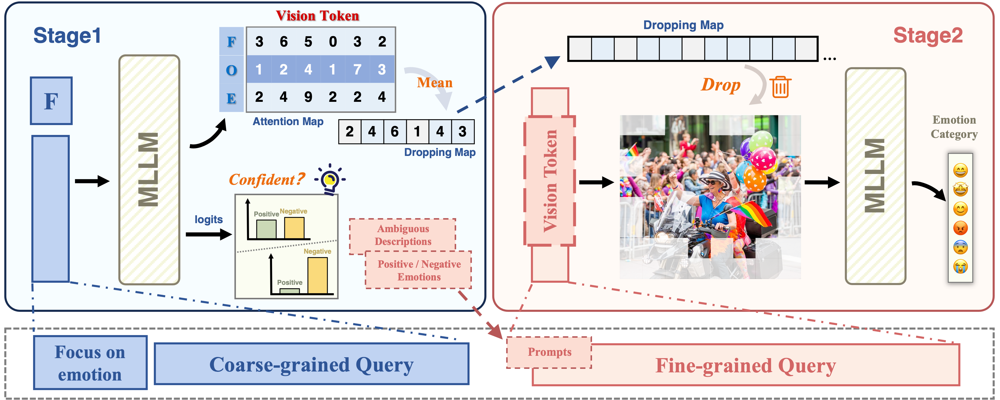








# Short Bio

Hi there! My name is Yiyang Fang (方羿阳), I am currently a first-year Master student in the [School of Computer Science at Wuhan University](https://cs.whu.edu.cn/), advised by Prof. [Mang Ye](https://scholar.google.com/citations?user=j-HxRy0AAAAJ&hl=zh-CN). Previously, I received my bachelor degree from the [School of Computer Science and Technology at Shandong University](https://www.cs.sdu.edu.cn/) in 2024. If you are interested in collaborating with me or want to have a chat, always feel free to contact me through e-mail.

My research mainly focuses on **Multimodal Emotion Recognition**.

# 🔥 News

<ul>
  <li><em>2025.02:</em> 🚀 EMOE was accepted to <strong>CVPR 2025</strong>.</li>
</ul>

# 📝 Publications 

&dagger;: equal contribution, * : corresponding author

<dl>
  <dt></dt>
  <dd><a class="publication-title">EMOE: Modality-Specific Enhanced Dynamic Emotion Experts</a></dd>
  <dd><strong>Yiyang Fang&dagger;</strong>, Wenke Huang&dagger;, Guancheng Wan&dagger;, Kehua Su*, Mang Ye*</dd>
  <dd>Conference on Computer Vision and Pattern Recognition <strong>(CVPR)</strong>, 2025</dd>
</dl>

## ⌛️ In Submission & Preprint

<dl>
  <dt></dt>
  <dd><a class="publication-title">Catch Your Emotion: Sharpening Emotion Perception in Multimodal Large Language Models</a></dd>
  <dd><strong>Yiyang Fang&dagger;</strong>, Jian Liang&dagger;, Wenke Huang&dagger;, He Li, Kehua Su*, Mang Ye*</dd>
  <dd>Under Review</dd>
</dl>

<dl>
  <dt></dt>
  <dd><a href="https://arxiv.org/abs/2503.04543" class="publication-title">Keeping Yourself is Important in Downstream Tuning Multimodal Large Language Model</a></dd>
  <dd>Wenke Huang&dagger;, Jian Liang&dagger;, Xianda Guo&dagger;, <strong>Yiyang Fang&dagger;</strong> <strong>(co-first)</strong>, Guancheng Wan&dagger;, Xuankun Rong, Chi Wen, Zekun Shi, Qingyun Li, Didi Zhu, Yanbiao Ma, Ke Liang, Bin Yang, He Li, Jiawei Shao, Mang Ye*, Bo Du*</dd>
  <dd>Under Review</dd>
</dl>

# 📖 Educations

- *2024.09 - now*, Master Student, School of Computer Science, Wuhan University, China.
- *2020.09 - 2024.06*, Bachelor, School of Computer Science and Technology, Shandong University, China.

